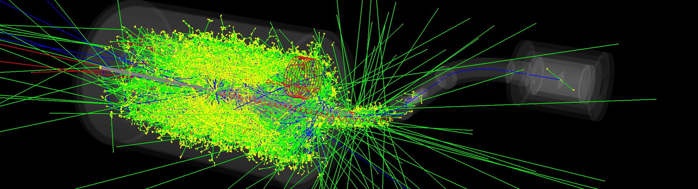

# MACE


- [MACE](#mace)
- [Introduction](#introduction)
- [How to Install](#how-to-install)
  - [External dependencies](#external-dependencies)
    - [Toolchain](#toolchain)
    - [Libraries](#libraries)
  - [Prepare for your PC](#prepare-for-your-pc)
    - [Linux](#linux)
    - [Windows](#windows)
  - [Prepare for public cluster/supercomputer](#prepare-for-public-clustersupercomputer)
  - [Build](#build)
- [How to Run](#how-to-run)
  - [SimMACE](#simmace)
  - [SimTarget](#simtarget)
  - [ReconTracks](#recontracks)
- [Cite](#cite)
  - [The offline software system](#the-offline-software-system)
  - [The experiment](#the-experiment)

# Introduction

This software is designed for MACE experiment. It consists of several modules: Core, Reconstruction, Simulation, and Utility. The "Simulation" module implements the simulation part of the experiment based on Geant4, including the simulation of the whole experiment (SimMACE) and the simulation of each subsystem (SimEMCal, SimMCP, SimCDC, etc.). The "Reconstruction" module implements the event reconstruction of the experiment. The "Core" module includes three sub modules: "Datamodel", "Geometry" and "Field", which implement the event data model required by mace (and the interface required for expansion), detector geometry, and electromagnetic field, respectively. The "Utility" module provides some common practicle tools that may be used in programming.



# How to Install

To build MACE software from source, there are a few prerequisites.

## External dependencies

### Toolchain

1. C/C++ compiler that supports ≥ C++20. ([GCC](https://gcc.gnu.org/) ≥ 10, [Clang](https://clang.llvm.org/) ≥ 12, MSVC ≥ 19.30 ([Visual Studio](https://visualstudio.microsoft.com/) 2022))
2. [CMake](https://cmake.org/) (≥ 3.16)

### Libraries

Required:

1. [MPI](https://www.mpi-forum.org/) (≥ 2.0, [MPICH](https://www.mpich.org/), [OpenMPI](https://www.open-mpi.org/), [Intel MPI](https://www.intel.cn/content/www/cn/zh/developer/tools/oneapi/mpi-library.html), [Microsoft MPI](https://github.com/Microsoft/Microsoft-MPI), etc. On your frequency)
2. [ROOT](https://root.cern/) (≥ 6.26.00)
3. [Geant4](https://geant4.web.cern.ch/) (≥ 11.0.0)

Required, built-in if not found:

1. [argparse](https://github.com/p-ranav/argparse) (≥ 2.6, built-in if not found (network or pre-downloaded source is required))
2. [backward-cpp](https://github.com/bombela/backward-cpp) (≥ 1.6, built-in if not found (network or pre-downloaded source is required))
3. [Eigen](https://eigen.tuxfamily.org/) (≥ 3.3.0, built-in if not found (network or pre-downloaded source is required))
4. [Microsoft.GSL](https://github.com/Microsoft/GSL) ([ISO C++ guidelines support library](https://github.com/isocpp/CppCoreGuidelines/blob/master/CppCoreGuidelines.md#gsl-guidelines-support-library)) (≥ 4.0.0, built-in if not found (network or pre-downloaded source is required))
5. [yaml-cpp](https://github.com/jbeder/yaml-cpp) (≥ 0.6.0, built-in if not found (network or pre-downloaded source is required))

Optional:

1. Geant4::G4gdml (Geant4 optional component. The requirement is controlled by CMake option MACE_USE_G4GDML. It supports the export of G4 geometry.)

## Prepare for your PC  

### Linux

[Geant4](https://geant4.web.cern.ch/) and [ROOT](https://root.cern/) need to be installed on your PC following the official guides. They need to be compiled with at least C++17.

[MPI](https://www.mpi-forum.org/) ([MPICH](https://www.mpich.org/), or [OpenMPI](https://www.open-mpi.org/), or [Intel MPI](https://www.intel.cn/content/www/cn/zh/developer/tools/oneapi/mpi-library.html), or [Microsoft MPI](https://github.com/Microsoft/Microsoft-MPI), or etc.), [Eigen](https://eigen.tuxfamily.org/), and [yaml-cpp](https://github.com/jbeder/yaml-cpp) can be installed via package manager (apt, yum, etc.) respect to your Linux distrbution. For example, you can install MPICH, Eigen, and yaml-cpp on Ubuntu (at least focal (20.04)) with following commands

```shell
sudo apt update
sudo apt install mpich libeigen3-dev libyaml-cpp-dev
```

The earlier distribution (e.g. Ubuntu earlier than focal) may not be able to obtain Eigen or yaml-cpp of the matching version through the package manager. At this time, it is good to use the built-in libraries. MPI is generally not a problem because the requirement for it is quite low (2.0). But if this does become a problem, it is worthwhile to spend some time compiling one for yourself. There are not many obstacles in compiling it.

### Windows

Although it is supported to run on Windows, it is indeed not very recommended. On the one hand, Windows itself does not fit well with HPC applications: it has relatively poor file system performance (compared with Linux), and its support for NUMA is also not good (before Windows 10 build 20348, see [here](https://docs.microsoft.com/en-us/Windows/win32/procthread/numa-support#numa-support-on-systems-with-more-than-64-logical-processors)). On the other hand, it is difficult to install "good-looking" G4 on Windows (the default Win32 visualization has nothing to do with good-looking), which is largely due to the slight trouble of installing Qt.

But it doesn't really matter - only if you can tolerate relatively poor performance and less pretty visualization (very likely). To install on windows, the first thing you need to do is to install [Visual Studio](https://visualstudio.microsoft.com/) 2022 (and its C++ components), and [CMake](https://cmake.org/). Then you can either directly install the precompiled version of [ROOT](https://root.cern/) and [Geant4](https://geant4.web.cern.ch/) (Note: using the precompiled version of Geant4 means that there is no support for gdml. If you need gdml, please compile a G4 with gdml. This is relatively troublesome, because you need to compile a [Xerces-C++](https://xerces.apache.org/xerces-c/) before this), or compile them manually. Then you need to add Geant4, ROOT and CMake (if you haven't choose to add environment variables when installing) to the environment variables. The rest of the dependencies only need to depend on the built-ins, unless you are able to install them all.

## Prepare for public cluster/supercomputer  

Unless you use container (e.g. [Apptainer](http://apptainer.org/)), you may need to do everything yourself - at this time, it is usually a more efficient option to turn to an expert of environment configuring to help you. It is not easy to build a complete and stable tool chain from scratch on a supercomputer that often lacks many libraries. If you are a master of environment building, we don't have to say much. You just need to confidently configure the environment following what we described above. In addition, if you choose to use container, it should be noted that some supercomputers have their own MPI implementation, which is likely to be optimized based on the cluster topology, and may have better performance when used. If a container is used, the linked MPI may be inside the container, always a universal version that not optimized for a specific machine. If so, then this potential performance gain may be lost.

## Build

After everything prepared, it's time to build.  

MACE software follows a classical cmake & build procedure, for example,

(with [Ninja](https://ninja-build.org))
```shell
mkdir build
cd build
cmake -G Ninja <MACE_PROJECT_ROOT_DIR>
ninja
```
or, (with [GNU Make](https://www.gnu.org/software/make/))
```shell
mkdir build
cd build
cmake <MACE_PROJECT_ROOT_DIR>
make -j
```

That's ok to use other generators, respect to your preference.  

# How to Run

## SimMACE

In sequential mode with graphics:

```shell
./SimMACE
```

In sequential mode with a macro:

```shell
./SimMACE run.mac
```

In parallel mode with a macro:

```shell
mpirun -n N ./SimMACE run.mac
```

## SimTarget


## ReconTracks

Run as

```shell
./ReconTracks SimMACEResult.root <...>
```

(Development in progess.)

# Cite

## The offline software system

1. *En attendant Godot*...

## The experiment

1. [Snowmass2021 Whitepaper: Muonium to antimuonium conversion. In 2022 Snowmass Summer Study, 3 2022.](https://arxiv.org/pdf/2203.11406)
