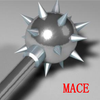
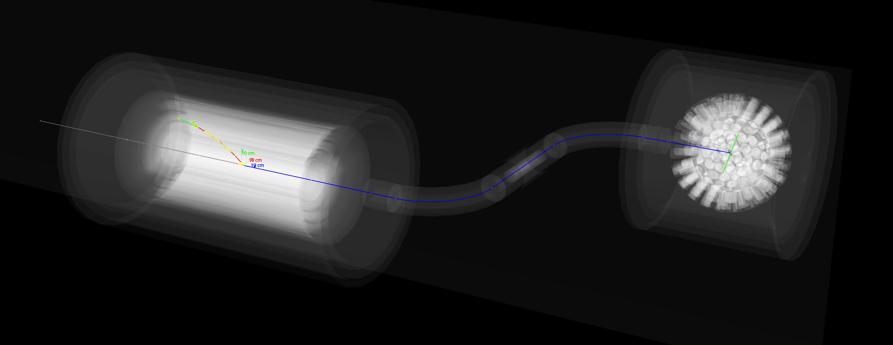

# MACE



- [MACE](#mace)
- [Pre-built binaries](#pre-built-binaries)
- [Dependencies](#dependencies)
  - [Toolchain](#toolchain)
  - [Libraries](#libraries)
- [Cite](#cite)



# Pre-built binaries

Pre-built, optimized binaries are available through [Apptainer](https://apptainer.org/) (formerly known as Singularity).

Obtain the apptainer image file (.sif) by
```shell
apptainer pull oras://docker.io/zhaoshh/mace:mpich
```
or
```shell
apptainer pull oras://docker.io/zhaoshh/mace:openmpi
```
depending on the MPI implementation you are using.
For more information, please check out [the image repository homepage](https://hub.docker.com/r/zhaoshh/mace).

# Dependencies

## Toolchain

1. A C++ compiler (that supports ≥ C++20. [GCC](https://gcc.gnu.org/) ≥ 12, [LLVM Clang](https://clang.llvm.org/) ≥ 16, or MSVC ≥ 19.30 (i.e., [Visual Studio](https://visualstudio.microsoft.com/) 2022 ≥ 17.0))
2. A C++ library (that supports ≥ C++20. [libstdc++](https://gcc.gnu.org/onlinedocs/libstdc++/) ≥ 12, or [MSVC STL](https://github.com/microsoft/STL) with [Visual Studio](https://visualstudio.microsoft.com/) 2022 ≥ 17.0)
3. [CMake](https://cmake.org/) (≥ 3.16)
4. A build system compatible with CMake ([GNU Make](https://www.gnu.org/software/make/), [Ninja](https://ninja-build.org), or etc.)

## Libraries

Required:

1. [Mustard (A modern offline software framework for HEP experiment )](https://github.com/zhao-shihan/Mustard) (≥ 0.0.1, built-in if not found)

Required, built-in if not found (network or pre-downloaded source is required):

1. [zhao-shihan/GenFit (A generic track-fitting toolkit)](https://github.com/zhao-shihan/GenFit) (a GenFit fork, built-in if not found)
2. [PMP (Polygon Mesh Processing Library)](https://www.pmp-library.org/) (≥ 3.0.0, built-in if not found)

# Cite

1. [A.-Y. Bai et al. (MACE working group), Snowmass2021 Whitepaper: Muonium to antimuonium conversion, in 2022 Snowmass Summer Study (2022), arXiv:2203.11406.](https://arxiv.org/abs/2203.11406)
2. [Shihan Zhao and Jian Tang, Optimization of muonium yield in perforated silica aerogel, arXiv:2401.00222.](https://arxiv.org/abs/2401.00222)
